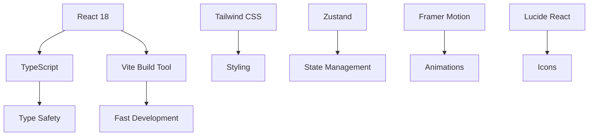

# Technical Documentation - DSA Interactive Visualizer

## Table of Contents

1. [Architecture Overview](#architecture-overview)
2. [TypeScript Implementation Guide](#typescript-implementation-guide)
3. [Component Structure](#component-structure)
4. [State Management](#state-management)
5. [Algorithm Implementations](#algorithm-implementations)
6. [Styling and Theming](#styling-and-theming)
7. [Performance Considerations](#performance-considerations)
8. [Development Workflow](#development-workflow)

## Architecture Overview

### Technology Stack Breakdown



### Project Dependencies

```json
{
  "dependencies": {
    "react": "^18.3.1",
    "react-dom": "^18.3.1",
    "typescript": "~5.6.2",
    "zustand": "^5.0.1",
    "framer-motion": "^11.11.17",
    "lucide-react": "^0.454.0"
  },
  "devDependencies": {
    "@vitejs/plugin-react": "^4.3.3",
    "vite": "^7.1.5",
    "tailwindcss": "^3.4.14",
    "autoprefixer": "^10.4.20",
    "postcss": "^8.4.47",
    "eslint": "^9.13.0"
  }
}
```

## TypeScript Implementation Guide

### Core TypeScript Concepts Used

#### 1. Interface Definitions
```typescript
// Algorithm element interface for type safety
interface ArrayElement {
  value: number
  id: string
  state: 'normal' | 'comparing' | 'swapping' | 'sorted'
}

// Algorithm information structure
interface AlgorithmInfo {
  name: string
  definition: string
  timeComplexity: {
    best: string
    average: string
    worst: string
  }
  spaceComplexity: string
  advantages: string[]
  disadvantages: string[]
  useCase: string
  codeExamples: { [language: string]: string }
}
```

#### 2. Generic Types and Utility Types
```typescript
// Generic type for algorithm functions
type SortingAlgorithm = (
  array: ArrayElement[],
  updateCallback: (step: SortingStep) => void,
  speed: number
) => Promise<void>

// Utility type for algorithm names
type AlgorithmName = 'bubble' | 'quick' | 'merge' | 'insertion' | 'selection'

// Conditional types for different algorithm types
type AlgorithmType<T> = T extends 'sorting' ? SortingAlgorithm : 
                       T extends 'pathfinding' ? PathfindingAlgorithm : 
                       never
```

#### 3. Advanced TypeScript Features
```typescript
// Mapped types for algorithm configuration
type AlgorithmConfig<T extends AlgorithmName> = {
  [K in T]: {
    name: string
    function: SortingAlgorithm
    complexity: ComplexityInfo
  }
}

// Template literal types for dynamic keys
type EventKey<T extends string> = `on${Capitalize<T>}`

// Conditional rendering props
interface ConditionalProps<T extends boolean> {
  show: T
  children: T extends true ? React.ReactNode : never
}
```

### TypeScript Best Practices in the Project

#### 1. Strict Type Checking
```typescript
// tsconfig.json configuration
{
  "compilerOptions": {
    "strict": true,
    "noImplicitAny": true,
    "strictNullChecks": true,
    "strictFunctionTypes": true,
    "noImplicitReturns": true,
    "noUnusedLocals": true,
    "noUnusedParameters": true
  }
}
```

#### 2. Component Props Typing
```typescript
// Comprehensive component props interface
interface SortingControlsProps {
  onAlgorithmChange: (algorithm: AlgorithmName) => void
  onSpeedChange: (speed: number) => void
  onArraySizeChange: (size: number) => void
  onShuffle: () => void
  onSort: () => void
  onReset: () => void
  isRunning: boolean
  currentAlgorithm: AlgorithmName
  speed: number
  arraySize: number
}

// Using the interface in component definition
const SortingControls: React.FC<SortingControlsProps> = ({
  onAlgorithmChange,
  onSpeedChange,
  // ... other props
}) => {
  // Component implementation
}
```

#### 3. Type Guards and Assertion Functions
```typescript
// Type guard for algorithm validation
function isValidAlgorithm(algorithm: string): algorithm is AlgorithmName {
  return ['bubble', 'quick', 'merge', 'insertion', 'selection'].includes(algorithm)
}

// Assertion function for runtime type checking
function assertIsAlgorithm(value: unknown): asserts value is AlgorithmName {
  if (typeof value !== 'string' || !isValidAlgorithm(value)) {
    throw new Error(`Invalid algorithm: ${value}`)
  }
}
```

## Component Structure

### Component Hierarchy

```
App
├── Header
├── Main Content
│   ├── SortingSection
│   │   ├── SortingControls
│   │   ├── ArrayVisualizer
│   │   └── PerformanceMetrics
│   ├── AlgorithmInfoSection
│   │   └── AlgorithmInfoCard[]
│   └── ComparisonSection
│       └── AlgorithmComparison
└── Footer
```

### Component Design Patterns

#### 1. Compound Components Pattern
```typescript
// Main container component
const SortingSection: React.FC = () => {
  return (
    <section className="sorting-section">
      <SortingSection.Controls />
      <SortingSection.Visualizer />
      <SortingSection.Metrics />
    </section>
  )
}

// Sub-components attached to main component
SortingSection.Controls = SortingControls
SortingSection.Visualizer = ArrayVisualizer
SortingSection.Metrics = PerformanceMetrics
```

#### 2. Render Props Pattern
```typescript
interface VisualizerProps {
  array: ArrayElement[]
  children: (props: {
    renderElement: (element: ArrayElement, index: number) => React.ReactNode
    getElementStyle: (element: ArrayElement) => React.CSSProperties
  }) => React.ReactNode
}

const Visualizer: React.FC<VisualizerProps> = ({ array, children }) => {
  const renderElement = useCallback((element: ArrayElement, index: number) => (
    <div key={element.id} className={`array-element ${element.state}`}>
      {element.value}
    </div>
  ), [])

  const getElementStyle = useCallback((element: ArrayElement) => ({
    backgroundColor: getElementColor(element.state),
    transform: `translateY(${element.value * 2}px)`
  }), [])

  return (
    <div className="visualizer-container">
      {children({ renderElement, getElementStyle })}
    </div>
  )
}
```

#### 3. Custom Hooks Pattern
```typescript
// Custom hook for algorithm state management
function useAlgorithmVisualization(algorithm: AlgorithmName) {
  const [array, setArray] = useState<ArrayElement[]>([])
  const [isRunning, setIsRunning] = useState(false)
  const [statistics, setStatistics] = useState({
    comparisons: 0,
    swaps: 0,
    timeElapsed: 0
  })

  const runAlgorithm = useCallback(async (speed: number) => {
    setIsRunning(true)
    const startTime = Date.now()
    
    try {
      await algorithms[algorithm](array, (step) => {
        updateArrayWithStep(step)
        updateStatistics(step)
      }, speed)
    } finally {
      setIsRunning(false)
      setStatistics(prev => ({
        ...prev,
        timeElapsed: Date.now() - startTime
      }))
    }
  }, [algorithm, array])

  return {
    array,
    isRunning,
    statistics,
    runAlgorithm,
    shuffleArray: () => setArray(generateRandomArray()),
    resetArray: () => setArray(generateSortedArray())
  }
}
```

## State Management

### Zustand Store Implementation

#### 1. Main Algorithm Store
```typescript
import { create } from 'zustand'
import { devtools } from 'zustand/middleware'

interface AlgorithmStore {
  // Sorting state
  array: ArrayElement[]
  currentAlgorithm: AlgorithmName
  isRunning: boolean
  speed: number
  arraySize: number
  
  // Statistics
  statistics: {
    comparisons: number
    swaps: number
    timeElapsed: number
  }
  
  // Actions
  setArray: (array: ArrayElement[]) => void
  setAlgorithm: (algorithm: AlgorithmName) => void
  setSpeed: (speed: number) => void
  setArraySize: (size: number) => void
  updateStatistics: (update: Partial<Statistics>) => void
  resetStatistics: () => void
  shuffleArray: () => void
  
  // Pathfinding state (planned)
  grid: PathfindingNode[][]
  startNode: Coordinates | null
  endNode: Coordinates | null
  
  // Pathfinding actions (planned)
  setGrid: (grid: PathfindingNode[][]) => void
  setStartNode: (node: Coordinates) => void
  setEndNode: (node: Coordinates) => void
}

export const useAlgorithmStore = create<AlgorithmStore>()(
  devtools(
    (set, get) => ({
      // Initial state
      array: [],
      currentAlgorithm: 'bubble',
      isRunning: false,
      speed: 500,
      arraySize: 20,
      statistics: {
        comparisons: 0,
        swaps: 0,
        timeElapsed: 0
      },
      
      // Actions implementation
      setArray: (array) => set({ array }),
      setAlgorithm: (algorithm) => set({ currentAlgorithm: algorithm }),
      setSpeed: (speed) => set({ speed }),
      setArraySize: (size) => set({ arraySize: size }),
      
      updateStatistics: (update) => set((state) => ({
        statistics: { ...state.statistics, ...update }
      })),
      
      resetStatistics: () => set({
        statistics: { comparisons: 0, swaps: 0, timeElapsed: 0 }
      }),
      
      shuffleArray: () => {
        const { arraySize } = get()
        const newArray = generateRandomArray(arraySize)
        set({ array: newArray })
      }
    }),
    { name: 'algorithm-store' }
  )
)
```

#### 2. Store Selectors for Performance
```typescript
// Optimized selectors to prevent unnecessary re-renders
export const useArrayState = () => useAlgorithmStore(state => state.array)
export const useRunningState = () => useAlgorithmStore(state => state.isRunning)
export const useStatistics = () => useAlgorithmStore(state => state.statistics)
export const useAlgorithmActions = () => useAlgorithmStore(state => ({
  setArray: state.setArray,
  setAlgorithm: state.setAlgorithm,
  shuffleArray: state.shuffleArray,
  resetStatistics: state.resetStatistics
}))
```

## Algorithm Implementations

### Algorithm Structure Pattern

All sorting algorithms follow a consistent pattern:

```typescript
export async function algorithmName(
  array: ArrayElement[],
  updateCallback: (step: SortingStep) => void,
  speed: number
): Promise<void> {
  // 1. Create working copy of array
  const arr = [...array]
  const steps: SortingStep[] = []
  
  // 2. Algorithm implementation with step recording
  // ... algorithm logic ...
  
  // 3. Execute steps with animation
  for (const step of steps) {
    updateCallback(step)
    await new Promise(resolve => setTimeout(resolve, speed))
  }
}
```

### Step-by-Step Algorithm Analysis

#### 1. Bubble Sort Implementation Details
```typescript
export async function bubbleSort(
  array: ArrayElement[],
  updateCallback: (step: SortingStep) => void,
  speed: number
): Promise<void> {
  const arr = [...array]
  const steps: SortingStep[] = []
  
  // Outer loop: n-1 passes
  for (let i = 0; i < arr.length - 1; i++) {
    // Inner loop: comparisons in current pass
    for (let j = 0; j < arr.length - i - 1; j++) {
      // Record comparison step
      steps.push({
        type: 'compare',
        indices: [j, j + 1],
        message: `Comparing ${arr[j].value} and ${arr[j + 1].value}`
      })
      
      // Swap if elements are in wrong order
      if (arr[j].value > arr[j + 1].value) {
        steps.push({
          type: 'swap',
          indices: [j, j + 1],
          message: `Swapping ${arr[j].value} and ${arr[j + 1].value}`
        })
        
        // Perform the swap
        const temp = arr[j].value
        arr[j].value = arr[j + 1].value
        arr[j + 1].value = temp
      }
    }
    
    // Mark element as sorted
    steps.push({
      type: 'set_sorted',
      indices: [arr.length - 1 - i],
      message: `Element ${arr[arr.length - 1 - i].value} is in final position`
    })
  }
  
  // Execute steps with timing
  for (const step of steps) {
    updateCallback(step)
    await new Promise(resolve => setTimeout(resolve, speed))
  }
}
```

#### 2. Merge Sort with Detailed Visualization
```typescript
export async function mergeSort(
  array: ArrayElement[],
  updateCallback: (step: SortingStep) => void,
  speed: number
): Promise<void> {
  const arr = [...array]
  const steps: SortingStep[] = []
  
  function mergeSortHelper(left: number, right: number) {
    if (left < right) {
      const mid = Math.floor((left + right) / 2)
      
      // Record divide step
      steps.push({
        type: 'compare',
        indices: Array.from({length: right - left + 1}, (_, i) => left + i),
        message: `Dividing array from index ${left} to ${right}`
      })
      
      // Recursive calls
      mergeSortHelper(left, mid)
      mergeSortHelper(mid + 1, right)
      
      // Merge sorted halves
      merge(left, mid, right)
    }
  }
  
  function merge(left: number, mid: number, right: number) {
    // Create temporary arrays
    const leftArr = arr.slice(left, mid + 1).map(el => el.value)
    const rightArr = arr.slice(mid + 1, right + 1).map(el => el.value)
    
    let i = 0, j = 0, k = left
    
    // Merge process with visualization
    while (i < leftArr.length && j < rightArr.length) {
      steps.push({
        type: 'compare',
        indices: [k],
        message: `Comparing ${leftArr[i]} and ${rightArr[j]}`
      })
      
      if (leftArr[i] <= rightArr[j]) {
        arr[k].value = leftArr[i]
        steps.push({
          type: 'swap',
          indices: [k],
          message: `Placing ${leftArr[i]} at position ${k}`
        })
        i++
      } else {
        arr[k].value = rightArr[j]
        steps.push({
          type: 'swap',
          indices: [k],
          message: `Placing ${rightArr[j]} at position ${k}`
        })
        j++
      }
      k++
    }
    
    // Handle remaining elements
    while (i < leftArr.length) {
      arr[k].value = leftArr[i]
      steps.push({
        type: 'swap',
        indices: [k],
        message: `Placing remaining ${leftArr[i]} at position ${k}`
      })
      i++
      k++
    }
    
    while (j < rightArr.length) {
      arr[k].value = rightArr[j]
      steps.push({
        type: 'swap',
        indices: [k],
        message: `Placing remaining ${rightArr[j]} at position ${k}`
      })
      j++
      k++
    }
  }
  
  // Start the sorting process
  mergeSortHelper(0, arr.length - 1)
  
  // Execute all steps
  for (const step of steps) {
    updateCallback(step)
    await new Promise(resolve => setTimeout(resolve, speed))
  }
}
```

## Styling and Theming

### Tailwind CSS Configuration

```javascript
// tailwind.config.js
module.exports = {
  content: [
    "./index.html",
    "./src/**/*.{js,ts,jsx,tsx}",
  ],
  darkMode: 'class',
  theme: {
    extend: {
      colors: {
        primary: {
          50: '#eff6ff',
          100: '#dbeafe',
          200: '#bfdbfe',
          300: '#93c5fd',
          400: '#60a5fa',
          500: '#3b82f6',
          600: '#2563eb',
          700: '#1d4ed8',
          800: '#1e40af',
          900: '#1e3a8a',
        },
        secondary: {
          50: '#f0f9ff',
          100: '#e0f2fe',
          200: '#bae6fd',
          300: '#7dd3fc',
          400: '#38bdf8',
          500: '#0ea5e9',
          600: '#0284c7',
          700: '#0369a1',
          800: '#075985',
          900: '#0c4a6e',
        }
      },
      animation: {
        'fade-in': 'fadeIn 0.5s ease-in-out',
        'slide-up': 'slideUp 0.3s ease-out',
        'pulse-slow': 'pulse 3s cubic-bezier(0.4, 0, 0.6, 1) infinite',
      },
      keyframes: {
        fadeIn: {
          '0%': { opacity: '0' },
          '100%': { opacity: '1' },
        },
        slideUp: {
          '0%': { transform: 'translateY(100%)', opacity: '0' },
          '100%': { transform: 'translateY(0)', opacity: '1' },
        }
      }
    },
  },
  plugins: [],
}
```

### Component Style Patterns

#### 1. Utility Classes for Consistency
```css
/* Global utility classes */
@layer components {
  .algorithm-card {
    @apply bg-white dark:bg-slate-800 rounded-xl shadow-lg border border-slate-200 dark:border-slate-700 p-6 hover:shadow-xl transition-all duration-300;
  }
  
  .algorithm-button {
    @apply px-4 py-2 rounded-lg font-medium transition-all duration-200 focus:outline-none focus:ring-2 focus:ring-offset-2;
  }
  
  .algorithm-button-primary {
    @apply algorithm-button bg-primary-600 hover:bg-primary-700 text-white focus:ring-primary-500;
  }
  
  .visualizer-container {
    @apply bg-white dark:bg-slate-800 rounded-xl shadow-lg border border-slate-200 dark:border-slate-700 p-8;
  }
  
  .array-element {
    @apply bg-primary-100 dark:bg-primary-900 border-2 border-primary-300 dark:border-primary-700 rounded-lg flex items-center justify-center font-bold text-primary-800 dark:text-primary-200 transition-all duration-300;
  }
  
  .array-element-comparing {
    @apply bg-yellow-200 dark:bg-yellow-800 border-yellow-400 dark:border-yellow-600 text-yellow-800 dark:text-yellow-200;
  }
  
  .array-element-swapping {
    @apply bg-red-200 dark:bg-red-800 border-red-400 dark:border-red-600 text-red-800 dark:text-red-200;
  }
  
  .array-element-sorted {
    @apply bg-green-200 dark:bg-green-800 border-green-400 dark:border-green-600 text-green-800 dark:text-green-200;
  }
}
```

#### 2. Dynamic Styling with TypeScript
```typescript
// Type-safe style generation
type ElementState = 'normal' | 'comparing' | 'swapping' | 'sorted'

const getElementStyles = (state: ElementState): string => {
  const baseStyles = 'array-element'
  
  const stateStyles: Record<ElementState, string> = {
    normal: '',
    comparing: 'array-element-comparing',
    swapping: 'array-element-swapping',
    sorted: 'array-element-sorted'
  }
  
  return `${baseStyles} ${stateStyles[state]}`
}

// Usage in component
const ArrayElement: React.FC<{ element: ArrayElement }> = ({ element }) => (
  <div className={getElementStyles(element.state)}>
    {element.value}
  </div>
)
```

## Performance Considerations

### React Performance Optimization

#### 1. Memoization Strategies
```typescript
// Component memoization
const ArrayElement = React.memo<{ element: ArrayElement }>(({ element }) => (
  <div className={getElementStyles(element.state)}>
    {element.value}
  </div>
))

// Hook memoization
const useArrayVisualization = (array: ArrayElement[]) => {
  const renderedElements = useMemo(() => 
    array.map((element, index) => (
      <ArrayElement key={element.id} element={element} />
    )), 
    [array]
  )
  
  return renderedElements
}

// Callback memoization
const SortingControls: React.FC<SortingControlsProps> = ({ onSort, isRunning }) => {
  const handleSort = useCallback(() => {
    if (!isRunning) {
      onSort()
    }
  }, [onSort, isRunning])
  
  return (
    <button onClick={handleSort} disabled={isRunning}>
      Sort
    </button>
  )
}
```

#### 2. Efficient State Updates
```typescript
// Batch state updates
const updateArrayWithStep = (step: SortingStep) => {
  setArray(prevArray => {
    const newArray = [...prevArray]
    
    // Apply step changes
    step.indices.forEach(index => {
      switch (step.type) {
        case 'compare':
          newArray[index].state = 'comparing'
          break
        case 'swap':
          newArray[index].state = 'swapping'
          break
        case 'set_sorted':
          newArray[index].state = 'sorted'
          break
      }
    })
    
    return newArray
  })
}

// Debounced state updates for high-frequency changes
const useDebouncedState = <T>(initialValue: T, delay: number) => {
  const [value, setValue] = useState(initialValue)
  const [debouncedValue, setDebouncedValue] = useState(initialValue)
  
  useEffect(() => {
    const handler = setTimeout(() => {
      setDebouncedValue(value)
    }, delay)
    
    return () => clearTimeout(handler)
  }, [value, delay])
  
  return [debouncedValue, setValue] as const
}
```

### Algorithm Performance Optimization

#### 1. Efficient Array Operations
```typescript
// Use array methods that don't create new arrays unnecessarily
const shuffleArrayInPlace = (array: ArrayElement[]) => {
  for (let i = array.length - 1; i > 0; i--) {
    const j = Math.floor(Math.random() * (i + 1));
    [array[i], array[j]] = [array[j], array[i]]
  }
  return array
}

// Optimize comparison functions
const compareNumbers = (a: number, b: number): number => a - b
```

#### 2. Memory Management
```typescript
// Cleanup timeouts and intervals
useEffect(() => {
  const timeouts: NodeJS.Timeout[] = []
  
  const addTimeout = (callback: () => void, delay: number) => {
    const timeout = setTimeout(callback, delay)
    timeouts.push(timeout)
    return timeout
  }
  
  return () => {
    timeouts.forEach(clearTimeout)
  }
}, [])

// Efficient event listener cleanup
useEffect(() => {
  const handleKeyPress = (event: KeyboardEvent) => {
    if (event.code === 'Space') {
      toggleSort()
    }
  }
  
  document.addEventListener('keydown', handleKeyPress)
  return () => document.removeEventListener('keydown', handleKeyPress)
}, [toggleSort])
```

## Development Workflow

### Build Process

#### 1. Development Environment
```bash
# Install dependencies
npm install

# Start development server with hot reload
npm run dev

# Run type checking
npm run type-check

# Run linting
npm run lint

# Fix linting issues
npm run lint:fix
```

#### 2. Production Build
```bash
# Build for production
npm run build

# Preview production build
npm run preview

# Analyze bundle size
npm run analyze
```

### Code Quality Tools

#### 1. ESLint Configuration
```javascript
// .eslintrc.js
module.exports = {
  extends: [
    '@typescript-eslint/recommended',
    'plugin:react/recommended',
    'plugin:react-hooks/recommended'
  ],
  parser: '@typescript-eslint/parser',
  plugins: ['@typescript-eslint', 'react', 'react-hooks'],
  rules: {
    '@typescript-eslint/no-unused-vars': 'error',
    '@typescript-eslint/explicit-function-return-type': 'warn',
    'react/prop-types': 'off',
    'react-hooks/exhaustive-deps': 'warn'
  }
}
```

#### 2. TypeScript Configuration
```json
{
  "compilerOptions": {
    "target": "ES2020",
    "useDefineForClassFields": true,
    "lib": ["ES2020", "DOM", "DOM.Iterable"],
    "module": "ESNext",
    "skipLibCheck": true,
    "moduleResolution": "bundler",
    "allowImportingTsExtensions": true,
    "resolveJsonModule": true,
    "isolatedModules": true,
    "noEmit": true,
    "jsx": "react-jsx",
    "strict": true,
    "noUnusedLocals": true,
    "noUnusedParameters": true,
    "noFallthroughCasesInSwitch": true
  },
  "include": ["src"],
  "references": [{ "path": "./tsconfig.node.json" }]
}
```

### Testing Strategy

#### 1. Unit Testing Setup
```typescript
// Component testing with React Testing Library
import { render, screen, fireEvent } from '@testing-library/react'
import { SortingControls } from './SortingControls'

describe('SortingControls', () => {
  it('should call onSort when sort button is clicked', () => {
    const mockOnSort = jest.fn()
    
    render(
      <SortingControls 
        onSort={mockOnSort} 
        isRunning={false}
        currentAlgorithm="bubble"
      />
    )
    
    fireEvent.click(screen.getByText('Sort'))
    expect(mockOnSort).toHaveBeenCalledTimes(1)
  })
})
```

#### 2. Algorithm Testing
```typescript
// Algorithm unit tests
import { bubbleSort } from './sortingAlgorithms'

describe('bubbleSort', () => {
  it('should sort array correctly', async () => {
    const array = [
      { value: 3, id: '1', state: 'normal' },
      { value: 1, id: '2', state: 'normal' },
      { value: 2, id: '3', state: 'normal' }
    ]
    
    const steps: SortingStep[] = []
    const mockCallback = (step: SortingStep) => steps.push(step)
    
    await bubbleSort(array, mockCallback, 0)
    
    expect(steps).toContainEqual(
      expect.objectContaining({
        type: 'complete'
      })
    )
  })
})
```

---

This technical documentation provides a comprehensive guide to understanding and extending the DSA Interactive Visualizer project. For specific implementation details, refer to the source code and inline comments.